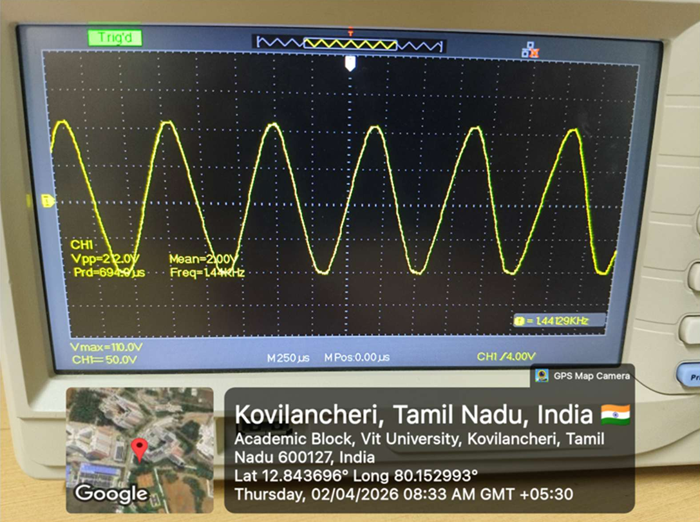
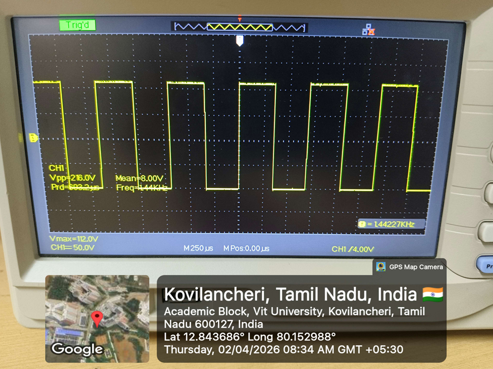
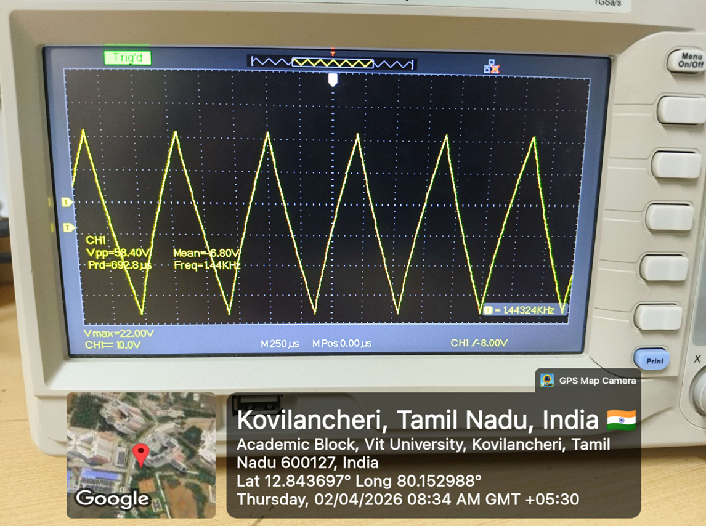

# Analog Function Generator using Op-Amps (741)

## 📌 Overview

This project implements an analog function generator capable of producing **sine, square, and triangular waveforms** using operational amplifiers (IC 741). The system uses a dual power supply derived from AC mains and multiple signal processing stages including oscillator, comparator, and integrator circuits.

---

## 🔹 Block Diagram

---

## 🔹 Working Principle

### 1. Power Supply Stage

* 230V AC is stepped down using a **12-0-12 transformer**
* Full bridge rectifier converts AC to DC
* A **1000µF capacitor** is used to filter ripple
* Output obtained: **±18V DC**
* Voltage regulators (**7812, 7912**) provide stable **+12V and -12V**

---

### 2. Wien Bridge Oscillator (Sine Wave Generation)

* Op-amp **741** configured as a Wien bridge oscillator
* Capacitor value: **0.1µF (104)**
* Resistor: **1.5kΩ + potentiometer (frequency control)**
* Produces a **stable sine wave**

---

### 3. Comparator (Square Wave Generation)

* Sine wave output is fed into a comparator
* Output is converted into a **square wave**

---

### 4. Integrator (Triangle Wave Generation)

* Square wave is passed through an integrator circuit
* Output becomes a **triangular wave**

---

### 5. Output Selection

* A switch is used to select one of the outputs:

  * Sine wave
  * Square wave
  * Triangle wave

---

### 6. Buffer and Output Stage

* Buffer circuit is used to isolate output
* Amplitude can be adjusted using a potentiometer
* Final stage can also act as attenuation (de-amplification)

---

## 🔹 Circuit Diagram

---

## 🔹 Simulation

This project is also implemented in **Tinkercad** for simulation and verification.

* Simulation link available in: `simulation/thinkercad_link.txt`

---

## 🔹 Output Waveforms

### Sine Wave

### Square Wave

### Triangle Wave

---

## 🔹 Components Used

* Transformer (12-0-12)
* Bridge Rectifier (Diodes)
* Capacitors (1000µF, 0.1µF)
* Voltage Regulators (7812, 7912)
* Operational Amplifier (IC 741)
* Resistors (1.5kΩ and others)
* Potentiometers (frequency & amplitude control)
* Switch (waveform selection)

---

## 🔹 Applications

* Signal generation for testing circuits
* Electronics laboratory experiments
* Communication system testing

---

## 🔹 Features

* Generates three types of waveforms
* Adjustable frequency
* Adjustable amplitude
* Dual power supply design

---

## 🔹 Author

**Naraender**
