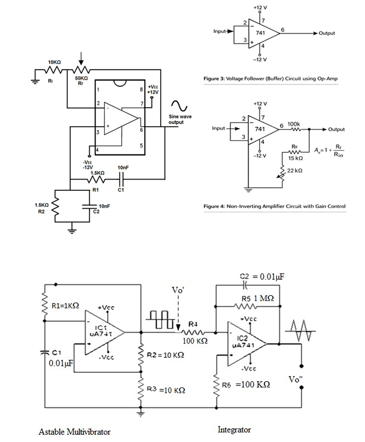
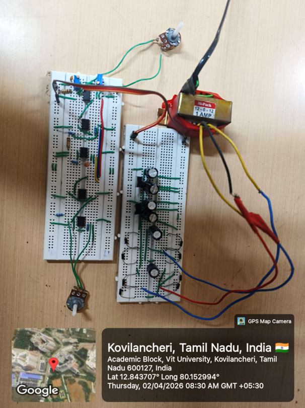

# Analog Function Generator using Op-Amps (741)

## 📌 Overview

This project implements an analog function generator capable of producing **sine, square, and triangular waveforms** using operational amplifiers. The design includes a dual power supply and multiple signal processing stages.

---

## 🔹 Block Diagram

---

## 🔹 Working Principle

### 1. Power Supply Stage

* 230V AC is stepped down using a transformer (12-0-12)
* Full-wave rectifier converts AC to DC
* 1000µF capacitor filters ripple
* Voltage regulators (LM7812, LM7912) provide stable ±12V

---

### 2. Wien Bridge Oscillator (Sine Wave)

* Generates sine wave using RC network
* Frequency controlled using potentiometer

---

### 3. Comparator (Square Wave)

* Converts sine wave into square wave

---

### 4. Integrator (Triangle Wave)

* Converts square wave into triangular wave

---

### 5. Output Selection

* Switch used to select waveform output

---

## 🔹 Circuit Diagram

---

## 🔹 Hardware Implementation

### Hardware Setup

The circuit is implemented using μA741 op-amps on a breadboard. A dual power supply (±12V) is provided using a transformer, rectifier, and voltage regulators. The setup generates sine, square, and triangular waveforms, which are observed using an oscilloscope.

---

## 🔹 Simulation Results

### Circuit (Tinkercad)

### Output Waveforms

#### Sine Wave

#### Square Wave

#### Triangle Wave

---

## 🔹 Simulation Link

🔗 [Open Tinkercad Simulation](https://www.tinkercad.com/things/32il4N5kGeb-function-generator)

---

## 🔹 Features

* Generates sine, square, and triangle waves
* Adjustable frequency
* Dual power supply (±12V)
* Real-time waveform visualization

---

## 🔹 Tools Used

* LTspice (Power supply simulation)
* Tinkercad (Circuit simulation)

---

## 🔹 Author

Naraender
