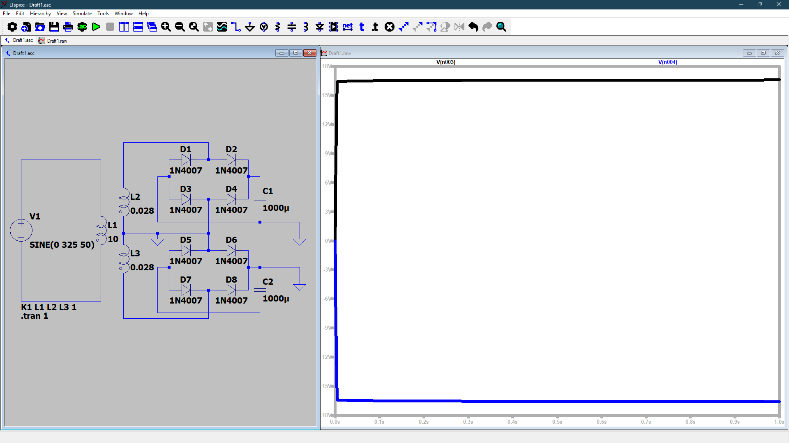
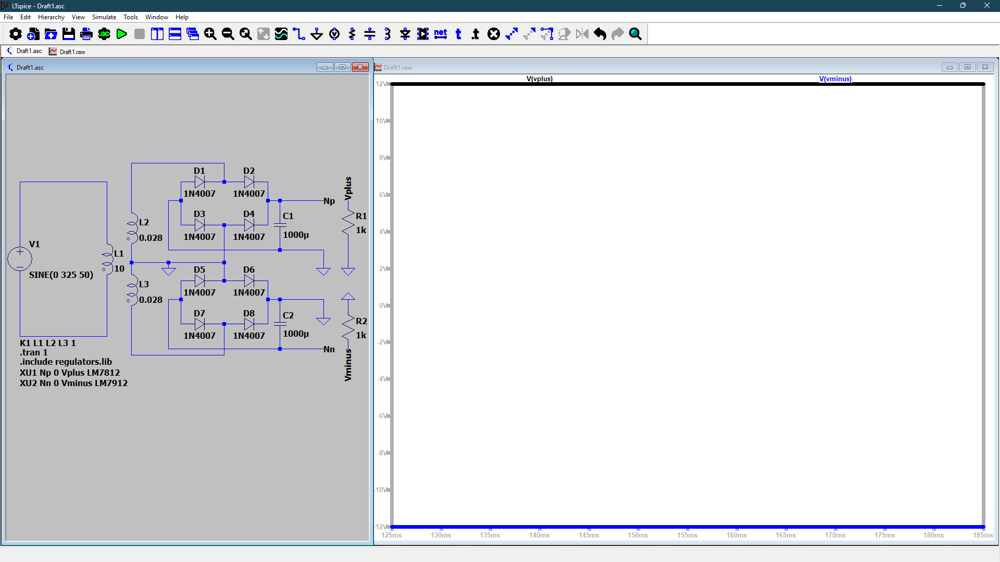
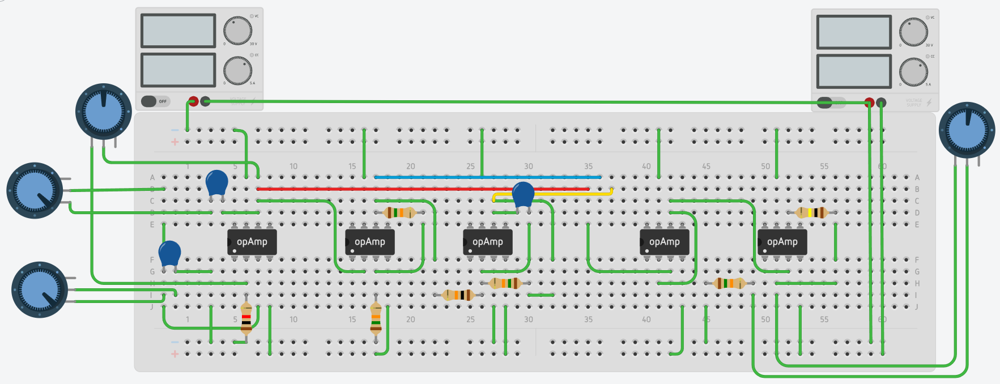
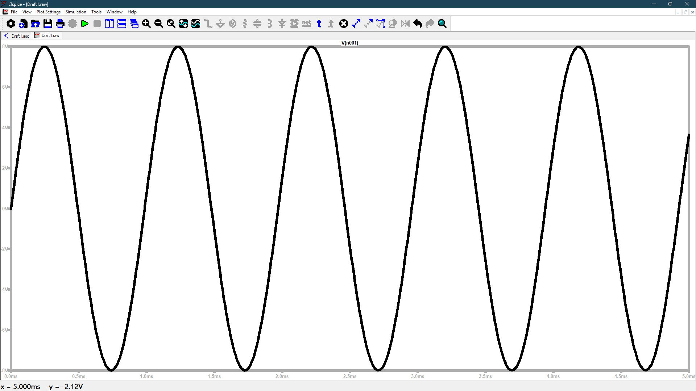
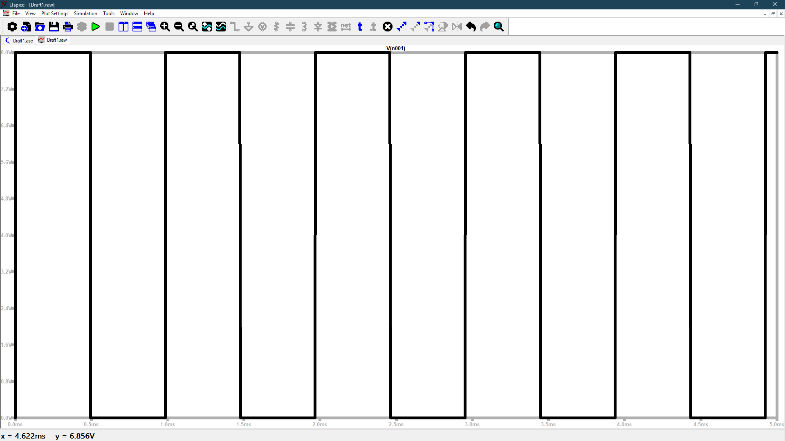
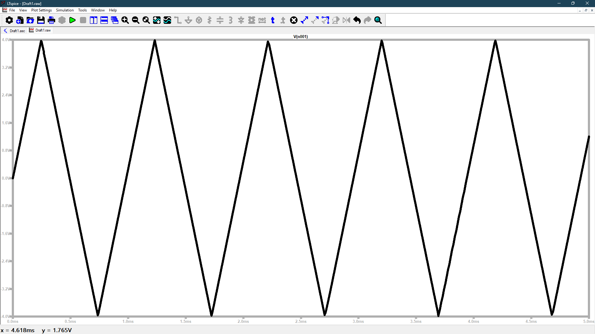

# 🔷 Analog Function Generator using Op-Amps (μA741)

## 📌 Overview

This project presents the design and implementation of an **analog function generator** capable of producing **sine, square, and triangular waveforms** using μA741 operational amplifiers. The system includes a regulated dual power supply and multiple signal processing stages to generate and shape waveforms.

---

## 🔹 Block Diagram

---

## 🔹 Working Principle

### 1. Power Supply Stage
- 230V AC input is stepped down using a **12-0-12 center-tapped transformer**
- Full-wave rectifier converts AC to DC
- Capacitors (1000µF) filter ripple
- Voltage regulators (**LM7812 and LM7912**) provide stable **±12V DC supply**

---

### 2. Wien Bridge Oscillator (Sine Wave)
- Generates a low-distortion sine wave
- Frequency controlled using RC network and potentiometer

---

### 3. Comparator (Square Wave)
- Converts sine wave into square wave using op-amp comparator

---

### 4. Integrator (Triangle Wave)
- Converts square wave into triangular waveform using op-amp integrator

---

### 5. Output Selection
- A switch is used to select between sine, square, and triangle outputs
- Final stage includes buffering and amplitude control

---

## 🔹 Circuit Diagram

---

## 🔹 Hardware Implementation

### Hardware Setup

The circuit is implemented on a breadboard using μA741 op-amps. A regulated dual power supply (±12V) is generated using a transformer, rectifier, and voltage regulators. The output waveforms are verified using an oscilloscope.

---

## 🔹 Simulation Results

### Power Supply (LTspice)
  

### Function Generator Circuit (Tinkercad)

---

### Output Waveforms

#### Sine Wave

#### Square Wave

#### Triangle Wave

---

## 🔹 Simulation Link

🔗 [Open Tinkercad Simulation](https://www.tinkercad.com/things/32il4N5kGeb-function-generator)

---

## 🔹 Results

- Sine wave frequency ≈ **1.4 kHz**
- Square wave amplitude ≈ **±12V**
- Triangle wave generated successfully using integrator
- Stable output observed in both simulation and hardware

---

## 🔹 Features

- Generates **three waveform types**: sine, square, triangle  
- Adjustable frequency using potentiometer  
- Dual regulated power supply (±12V)  
- Real-time waveform verification using oscilloscope  

---

## 🔹 Tools & Technologies

- **LTspice** – Power supply simulation  
- **Tinkercad** – Circuit simulation  
- **Breadboard Implementation** – Hardware testing  

---

## 🔹 Applications

- Signal generation for testing circuits  
- Educational demonstrations of waveform generation  
- Analog electronics experiments  

---

## 🔹 Author

**Naraender**
